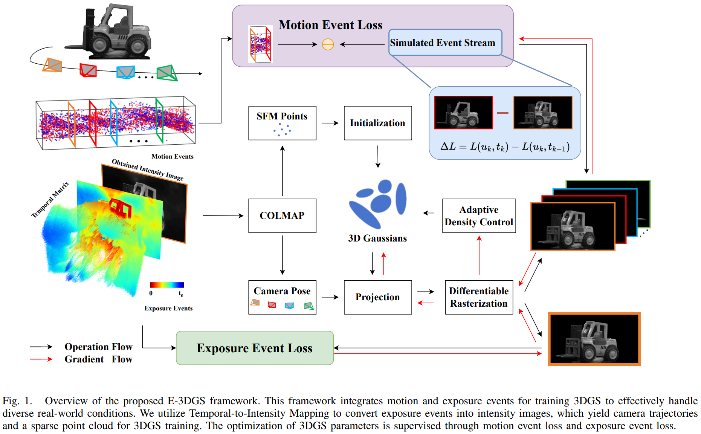

<p align="center">

  <h1 align="center">E-3DGS: Gaussian Splatting with Exposure and Motion Events</h1>
  <p align="center">
    <a href="https://www.researchgate.net/profile/Yin-Xiaoting"><strong>Xiaoting Yin</strong></a>
    ·
    <a href="https://scholar.google.com/citations?hl=zh-CN&user=0EI9msQAAAAJ"><strong>Hao Shi</strong></a>
    ·
    <a href="https://openreview.net/profile?id=~Yuhan_Bao1"><strong>Yuhan Bao</strong></a>
    ·
    <a href="https://scholar.google.com/citations?hl=zh-CN&user=eIz0XvMAAAAJ"><strong>Zhenshan Bing</strong></a>
    ·
    <a href="https://scholar.google.com/citations?hl=zh-CN&user=lTBMax0AAAAJ"><strong>Yiyi Liao</strong></a>
    ·
    <a href="https://scholar.google.com/citations?hl=zh-CN&user=pKFqWhgAAAAJ"><strong>Kailun Yang</strong></a>
    ·
    <a href="https://scholar.google.com/citations?hl=zh-CN&user=B6xWNvgAAAAJ"><strong>Kaiwei Wang</strong></a>
</p>

<h2 align="center"></h2>
  <div align="center">
    
  </div>

<p align="center">
    <a href="https://pytorch.org/get-started/locally/"></a>
    <br>
    <a href="https://arxiv.org/pdf/2410.16995">
      
    </a>
</p>

**E-3DGS** incorporate exposure event information into event-based 3D Gaussian Splatting (3DGS), converting sparse events during exposure into dense intensity frames for high-quality event-based 3D reconstruction.
To achieve high-quality 3D reconstruction using only a single event sensor, we combine motion and exposure events to balance quality and efficiency in high-speed scenarios.
In Fast Reconstruction Mode, E-3DGS achieves a PSNR gain of 5.68dB over EventNeRF, along with a significantly higher rendering speed (79.37 FPS vs. 0.03 FPS). 
In the HighQuality Reconstruction Mode, E-3DGS delivers a PSNR increase of 10.89 dB compared to the event-to-grayscale learning-based 3DGS baseline.
In the future, we intend to explore the application and enhancement of E-3DGS based on exposure events for dense robotic perception, aiming to achieve higher-quality large-scale dense 3D reconstruction using purely event-based data.

# TODO

- [ ] Release the code.
- [x] Release the [arxiv preprint](https://arxiv.org/pdf/2410.16995).

<br>

# Citation
If our work is helpful to you, please consider citing us by using the following BibTeX entry:
```
@misc{yin2024e3dgsgaussiansplattingexposure,
      title={E-3DGS: Gaussian Splatting with Exposure and Motion Events}, 
      author={Xiaoting Yin and Hao Shi and Yuhan Bao and Zhenshan Bing and Yiyi Liao and Kailun Yang and Kaiwei Wang},
      year={2024},
      eprint={2410.16995},
      archivePrefix={arXiv},
      primaryClass={cs.CV},
      url={https://arxiv.org/abs/2410.16995}, 
}
```
